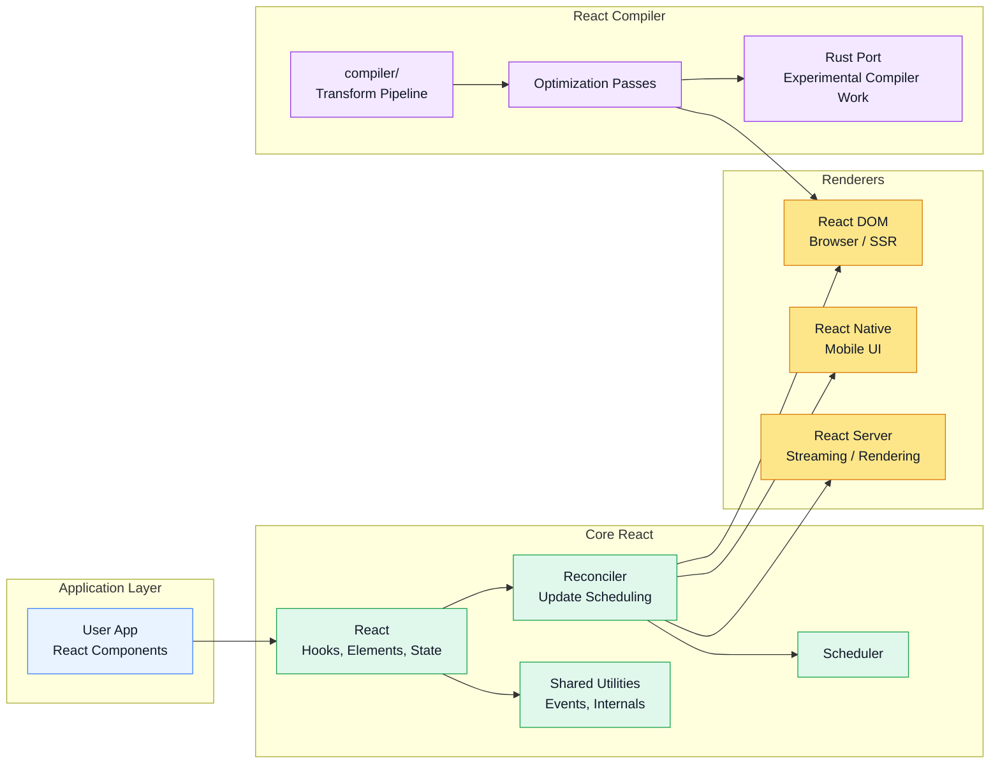

# React Architecture Overview

This repository is a monorepo containing the React runtime and the React Compiler. The main React packages live outside `compiler/`, while compiler-specific logic and tooling are isolated under that directory.

## Notes

- The `react` packages provide the core UI model and reconciliation engine.
- Renderer integrations such as DOM and Native adapt the reconciler to different targets.
- The compiler pipeline lives in `compiler/` and contains optimization and transformation steps.
- The Rust port work under `compiler/crates/` represents an experimental compiler implementation path.
